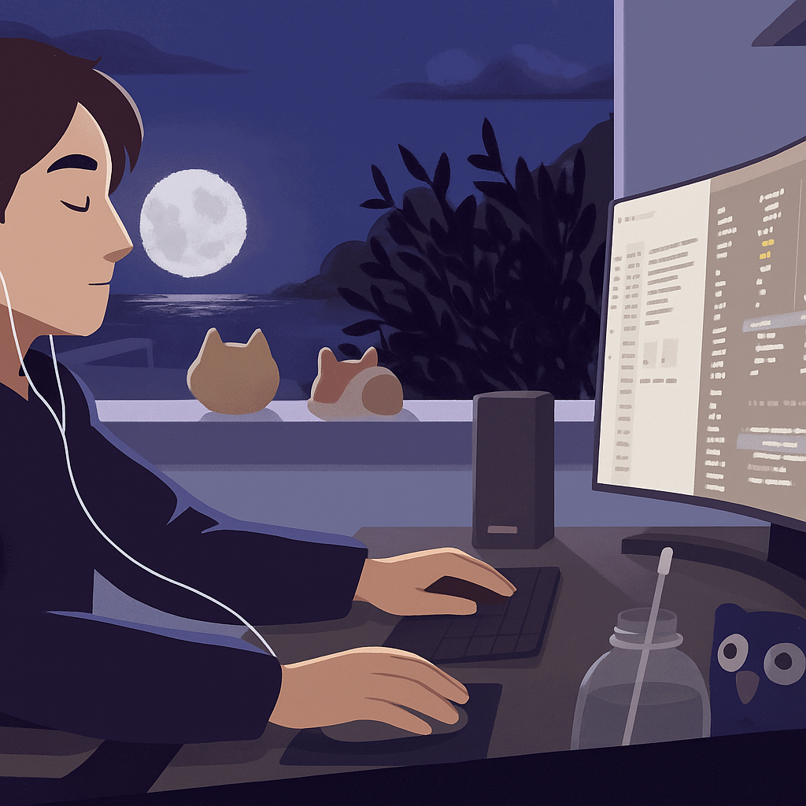

---

#### ABOUT ME
I'm **Mauricio Toledo**. I'm a **Software Engineer** based in Brazil, São Paulo. I always try to compete with the world, which makes me a better person than I am yesterday.

"If you learned something new today, you are better than yesterday."

---
  
#### SKILLS & TOOLS:

<code></code>
<code></code>
<code></code>
<code></code>
<code></code>
<code></code>
<code></code>
<code></code>

<!--
**toledomauricio/toledomauricio** is a ✨ _special_ ✨ repository because its `README.md` (this file) appears on your GitHub profile.

Here are some ideas to get you started:

- 🔭 I’m currently working on ...
- 🌱 I’m currently learning ...
- 👯 I’m looking to collaborate on ...
- 🤔 I’m looking for help with ...
- 💬 Ask me about ...
- 📫 How to reach me: ...
- 😄 Pronouns: ...
- ⚡ Fun fact: ...
-->
